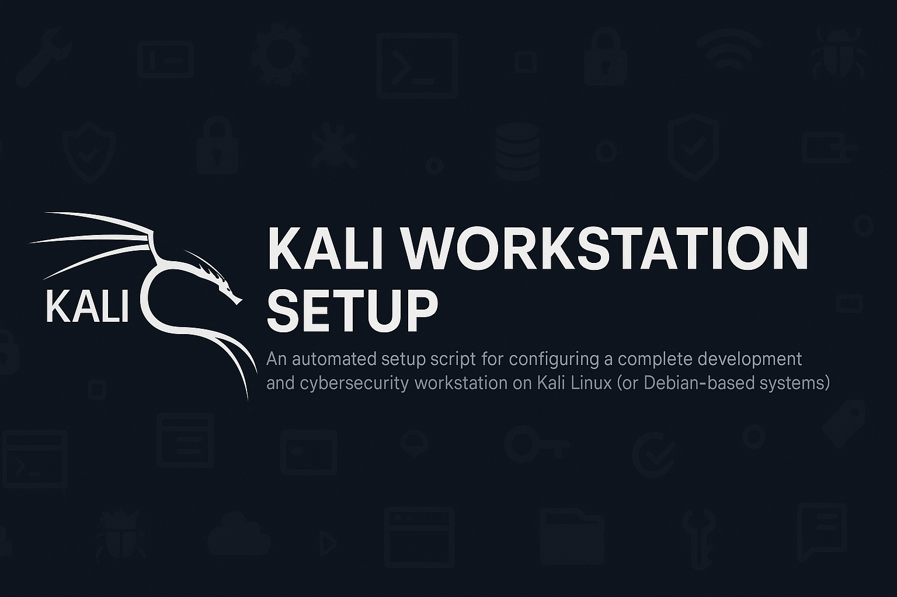

# Kali Workstation Setup

An automated setup script for configuring a complete development and cybersecurity workstation on Kali Linux (or Debian-based systems).

## Features

### 🛠️ Development Tools

- **VS Code** with essential extensions (Python, TypeScript, Docker, GitHub Copilot, etc.)
- **Android Studio** for mobile development
- **JetBrains Toolbox** for IDE management
- **Google Chrome** browser
- **Brave Browser** for privacy-focused browsing
- **Warp Terminal** for modern terminal experience
- **Docker Desktop** and Docker CLI
- **Postman** for API testing

### 🌐 Programming Languages & Runtimes

- **Python 3** with pip, virtualenv, poetry, jupyter
- **Node.js** with npm, yarn, NVM for version management
- **Java 21** (OpenJDK)
- **Go** programming language
- **Rust** programming language

### 🗄️ Databases

- **MongoDB** for NoSQL database operations
- **PostgreSQL** for relational database operations
- **Redis** for caching and session storage
- **SQLite** for lightweight database operations

### ☁️ DevOps & Cloud Tools

- **Docker** & Docker Compose
- **Kubernetes** (kubectl, k3s)
- **Terraform** for infrastructure as code
- **Ansible** for configuration management
- **AWS CLI** for Amazon Web Services
- **GitHub CLI** for GitHub integration
- **Helm** for Kubernetes package management

### 🔐 Cybersecurity Tools

- **Metasploit Framework**
- **Nmap** for network scanning
- **Wireshark** for packet analysis
- **Burp Suite** for web application testing
- **John the Ripper** for password cracking
- **Hashcat** for hash cracking
- **SQLMap** for SQL injection testing
- **Gobuster** & **Dirb** for directory enumeration
- **Hydra** for brute force attacks
- **Nikto** web vulnerability scanner

### 📱 Communication & Collaboration

- **Discord**
- **Slack**

### 🎨 Media & Graphics

- **LibreOffice Suite** (Writer, Calc, Impress, Draw, Base)
- **GIMP** for image editing
- **VLC** media player
- **Spotify** for music streaming
- **OBS Studio** for screen recording
- **ImageMagick** & **FFmpeg** for media processing

## Quick Start

1. Clone this repository:

   ```bash
   git clone <repository-url>
   cd workstation
   ```

2. Make the script executable:

   ```bash
   chmod +x install.sh
   ```

3. Run the setup script:

   ```bash
   ./install.sh
   ```

4. Reboot your system when prompted.

## What It Does

1. **System Update**: Updates all packages
2. **Package Installation**: Installs all packages from `packages.txt`
3. **Development Tools**: Installs VS Code, Android Studio, Chrome, Brave, Warp Terminal, etc.
4. **Database Setup**: Installs and configures MongoDB
5. **Office Suite**: Installs LibreOffice complete suite
6. **Environment Setup**: Configures environment variables for development
7. **Shell Configuration**: Sets up Zsh with Oh-My-Zsh and custom aliases
8. **Directory Structure**: Creates organized development directories
9. **Git Configuration**: Sets up Git with your credentials
10. **SSH Key Generation**: Creates SSH keys for secure connections
11. **VS Code Extensions**: Installs essential VS Code extensions
12. **Security Setup**: Enables UFW firewall

## Environment Variables

The script configures the following environment variables:

- **ANDROID_HOME**: Android SDK path
- **JAVA_HOME**: Java installation path
- **GOROOT** & **GOPATH**: Go language paths
- **NVM_DIR**: Node Version Manager directory
- **DEV_HOME**: Main development directory
- **DOCKER_BUILDKIT**: Docker build optimizations

## Directory Structure

After installation, your home directory will include:

```
~/Development/
├── projects/    # Your development projects
├── tools/       # Development tools and utilities
└── scripts/     # Custom scripts

~/Android/
└── Sdk/         # Android SDK

~/.local/bin/    # Local binaries
```

## Post-Installation Steps

1. **Android Studio**: Configure SDK path to `~/Android/Sdk`
2. **GitHub CLI**: Run `gh auth login` to authenticate
3. **AWS CLI**: Run `aws configure` to set up credentials
4. **SSH Keys**: Add your public key to GitHub/GitLab
5. **Docker**: You may need to log out and back in for Docker permissions

## Customization

- Edit `packages.txt` to add/remove system packages
- Modify dotfiles in the `dotfiles/` directory
- Update `install.sh` to add custom installation steps

## Aliases Available

### Git

- `gs` - git status
- `gc` - git commit -m
- `gp` - git push
- `gpl` - git pull
- `ga` - git add
- `gco` - git checkout

### Docker

- `dps` - docker ps
- `dcu` - docker-compose up
- `dcd` - docker-compose down

### Development

- `dev` - cd to projects directory
- `py` - python3
- `serve` - start HTTP server on port 8080

### Cybersecurity

- `recon` - nmap -A
- `scan` - nmap -sS -O
- `enum` - gobuster dir -u

## Requirements

- Kali Linux or Debian-based distribution
- Internet connection
- Sudo privileges

## License

MIT License - feel free to modify and distribute!
